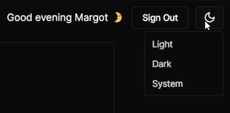
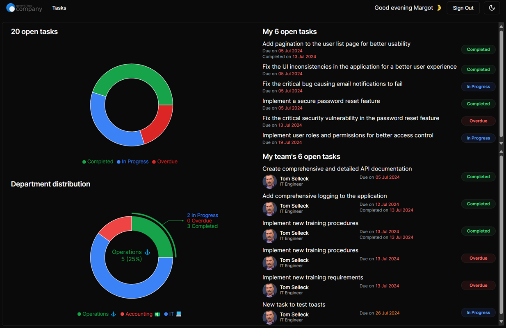
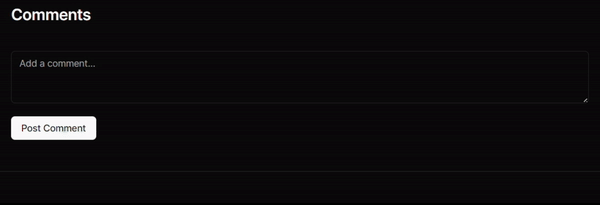
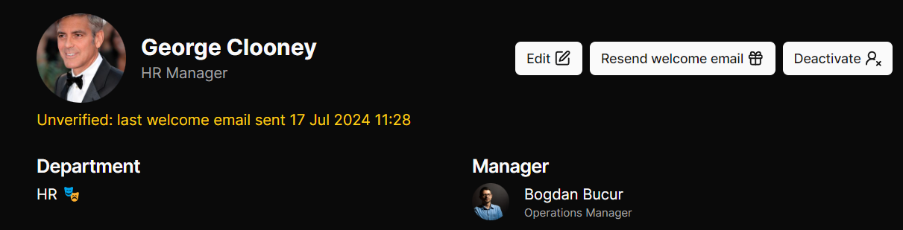
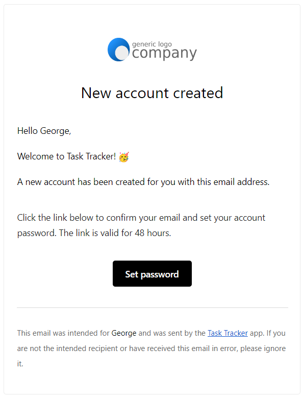
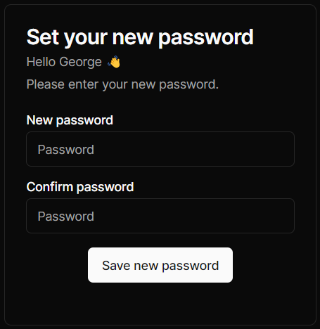
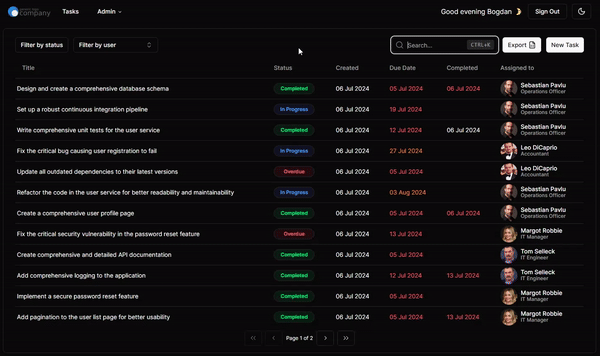
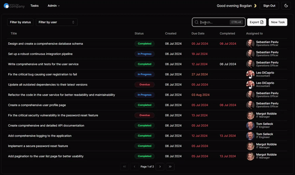
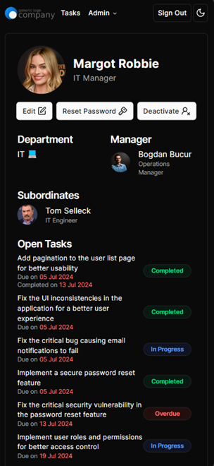
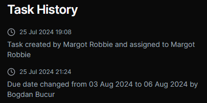

# 📋 Task Tracker

A web app to create, assign and manage tasks, built with the latest web technologies.

See a live deployment running on my Raspberry Pi [here](https://tasks.tetrabit.dev).

## 💎 Features

### 🚀 Intuitive tasks workflow

- Managers can create and edit tasks for themselves and their subordinates
- Users are notified when new tasks are assigned to them, when they are due soon or overdue
- Using comments, users can ask questions, provide updates and mention other users
- Upon task completion, users mark tasks as Completed and add their remarks
- Managers are notified of Completed tasks, review them and Close the tasks
- Administrators can make any change to any tasks
- All changes are logged and can be viewed by anyone for full transparency

### 🌛 Light and dark mode

Defaults to the user's system preference and preference is saved in local storage.



### 📈 Personalized user dashboard

Users see their pending tasks and tasks to review if they are managers, as well as company-wide statistics.



### 💬 Tasks comments system with user @mentions

Mention users in comments to notify them by email.



### 📩 Email notifications for important events

Assigned tasks, due soon tasks, overdue tasks and more email notifications.


### 🔑 Secure user management

Create and modify users and send password reset emails.


Users receive welcome and password reset emails and set their own passwords.



Administrators cannot set or ever see users' passwords which are hashed using [Argon2id](https://en.wikipedia.org/wiki/Argon2), an [industry-recognized](https://pages.nist.gov/800-63-4/sp800-63b.html) hashing algorithm, thus enforcing nonrepudiation.



### 🔍 Powerful filtering and search



### 📃 Tasks Excel export



### 📱 Responsive design

All features available on mobile devices.



### 📅 Task history

See all changes made to tasks, enforcing accountability.



### 👍 Other features

- Rate limiting to prevent brute force attacks on both IP and email, with separate limits
- Tasks source and completion attachments with automatic image previews and download links

## 💾 Tech stack

- Metaframework: [Next.js](https://nextjs.org/)
- Database: [SQLite](https://www.sqlite.org/index.html)
- ORM: [Prisma](https://www.prisma.io/)
- UI components: [shadcn-ui](https://ui.shadcn.com/)
- CSS framework: [Tailwind CSS](https://tailwindcss.com/)
- Authentication: [Lucia](https://lucia-auth.com/) and [Oslo](https://oslo.js.org/). Thanks to [Robin Wieruch](https://www.robinwieruch.de/) for his [excellent tutorial](https://www.robinwieruch.de/next-authentication/)
- Email: [Resend](https://resend.com/)

## 🛠️ Installation and setup

1. Install [Node.js](https://nodejs.org/en/)
2. Clone the repo `git clone`
3. `npm install` to install all dependencies
4. Create a `.env.local` file with the following content:

```env
RESEND_API_KEY="re_123"
BASE_URL="https://example.com"
EMAILS_FROM="Task Tracker <tasks@tasks.example.com>"
DAILY_TASKS_TOKEN="f7238d8c2b7da7a72f93de486dtc707f09a184b0f70"
DATABASE_URL="file:../db/database.db" # Change to file:/var/task-tracker/db/database.db in production
FILES_PATH="./files" # Change to /var/task-tracker/files in production
LOGS_PATH="./logs" # Change to /var/logs/task-tracker in production
MAX_FAILED_ATTEMPTS_EMAIL=10
MAX_FAILED_ATTEMPTS_IP=50
LOCKOUT_MINUTES=15
DEPLOYMENT="blue"
PORT=3001
DUE_SOON_DAYS="10"
OVERDUE_FOR_MORE_THAN_DAYS="5"
OVERDUE_REMINDER_EVERY_DAYS="7"
```

Example in `/config_examples`

Enter your Resend API key and your base URL.
Use any `DAILY_TASKS_TOKEN` you want. This is a secret key to call the daily tasks API so it cannot be executed remotely.

5. Create a `.env.test` file. Examples in `/config_examples`
6. Open `setup.sh` and change `APP_USER` to the Linux environment user
7. Update `DATABASE_URL`, `FILES_PATH` and `LOGS_PATH` in `.env.local` and `.env.test` as required
8. If deployed on Linux, run `./setup.sh` to create the database and files folders and set their permissions. The folders in the paths defined in `.env` will be created. If not deploying on Linux, create the paths folders manually
9. Run `npx prisma migrate deploy` to inialize the database
10. `npm run dev` to run in dev mode
11. `npm run build` to build the app and `npm start` to run in production mode
12. `npx prisma studio` and manually add the statuses:

| ID  | Name        | Display Name   | Color  |
| --- | ----------- | -------------- | ------ |
| 1   | In Progress | In Progress    | Blue   |
| 2   | Completed   | Pending Review | Green  |
| 3   | Closed      | Closed         | Gray   |
| 4   | Cancelled   | Cancelled      | Yellow |
| 5   | Overdue     | Overdue        | Red    |

### Automatic start with systemd

1. Create a service file `/etc/systemd/system/task-tracker.service` with the following content:

```ini
[Unit]
Description=Task Tracker
After=network.target

[Service]
Type=simple
User=root
Group=root
Restart=always
Restart=on-failure
RestartSec=10
WorkingDirectory=/path/to/app/task-tracker/
StandardOutput=/var/log/task-tracker.log
StandardError=/var/log/task-tracker.log
ExecStart=/usr/bin/npm start

[Install]
WantedBy=multi-user.target
```

2. Create the log file with `sudo touch /var/log/task-tracker.log`
3. Ensure the logfile has the user permissions with `sudo chmod 644 /var/log/task-tracker.log`
4. Restart the systemctl background process with `sudo systemctl daemon-reload`
5. Start the service with `sudo systemctl start task-tracker`
6. Enable the service to start at boot with `sudo systemctl enable task-tracker`
7. Check the status with `sudo systemctl status task-tracker`
8. If running a blue-green deployment, append `-blue` or `-green` to the service name

### Email worker

An email worker is required to send emails in the background. Schedule this worker with systemd.

1. Create a service file `/etc/systemd/system/email-worker.service` with the following content:

```ini
[Unit]
Description=Email worker

[Service]
WorkingDirectory=/path/to/app/task-tracker
ExecStart=/usr/bin/npm run email-worker
```

2. Create a timer file `/etc/systemd/system/email-worker.timer` with the following content:

```ini
[Unit]
Description=Run email worker every 5 seconds
[Timer]
OnBootSec=5seconds
OnUnitActiveSec=5seconds
Unit=email-worker.service
[Install]
WantedBy=timers.target
```

3. Start the timer with `sudo systemctl start email-worker.timer`
4. Enable the timer to start at boot with `sudo systemctl enable email-worker.timer`
5. Check the status with `sudo systemctl status email-worker.timer`

### Scheduled daily tasks

Schedule to run `npm run daily` to run all the daily tasks, just after midnight. This will clear unused password reset tokens and check for overdue and due soon tasks and send the email notifications.

You can use a cron job to run the script at a specific interval. For example, to run the script every daily at 01:00, add the following line to your crontab by running `crontab -e`:

```bsh
0 2 * * * cd /path/to/app/task-tracker/ && /usr/bin/npm run daily
```

### Scheduled daily database backups

You can use a cron job to run the script at a specific interval. For example, to run the script every daily at 02:00, add the following line to your crontab by running `crontab -e`:

```bsh
0 3 * * * cd /path/to/app/task-tracker/ && ./backup.sh
```

For network backups after the local backups, follow the instructions in `copy_backups.sh` and mount a network drive. You can then schedule the script to run after the local backups using a cron job.

### Restoring backups

Set the application user in `restore_backup.sh` to the Linux environment user. Similar to the setup script.

Use the existing `backup-[date].tar.gz` in the working directory or copy them from another location to the working directory.

Run `sudo ./restore_backup.sh` to restore the database and files folders. This will use the latest backup file found in the working directory to gracefully restore the database, task attachments and user avatars.

### Using Primsa with SQLite

#### First-time setup. Unnecessary if you clone the repo

1. `npm install prisma --save-dev`
2. `npx prisma init --datasource-provider sqlite`
3. Configure `./prisma/schema.prisma` to setup some models

#### When making schema changes

1. `npx prisma migrate dev --name whatever-change` for every change
2. If the migrations were pulled from a commit, run `npx prisma migrate deploy` to apply them
3. `npx prisma generate` to generate the client

#### Directly accessing the database

1. `npx prisma studio` to open the studio
2. To generate a password hash to insert in the database, change the `pass` const in `./lib/hashpass.js` and run `node ./lib/hashpass.js` to get the hash printed to the console

### Testing

Running `setup.sh` will create the test folders as well. To run the tests, use `npm test`. A testing database will be created and destroyed for each test run.

### SFTP VS Code extension setup

Run command pallette `Ctrl+Shift+P` and search for `SFTP: Config` to create a new configuration file. Add the following content:

```json
{
	"name": "Raspberry Pi",
	"host": "",
	"protocol": "sftp",
	"port": 22,
	"username": "",
	"password": "",
	"remotePath": "/path/to/app/task-tracker",
	"uploadOnSave": true
}
```

## Changelog

- 1.0.1 - Added missing users page pagination controls
- 1.0.2 - Fixed new user manager selection
- 1.0.3 - No indexing in robots.txt and metadata
- 1.0.4 - Increased source field character limit to 100 and reduced tasks items per page to 10
- 1.0.5 - Show dates in local time
- 1.0.6 - Fixed Close Task button being async
- 1.0.7 - Fixed `totalDaysWorkingOnTasks` user stat calculation
- 1.0.8 - Fixed daily tasks `dueSoonTasks` fetching logic
- 1.0.9 - Fixed Task History timestamps
- 1.0.10 - Better user logging
- 1.0.11 - `noTasksReviewedClosed` not updating
- 1.1.0 - Added user stats
- 1.1.1 - Fixed NaN task completion stats
- 1.1.2 - Fixed User stats average times
- 1.1.3 - Fixed average task review time calculation
- 1.2.0 - Task reviewing days changed from Int to Float
- 1.2.1 - Fixed task reviewing days calculation and display
- 1.2.2 - Increased the closing comment character limit from 200 to 1000
- 1.2.3 - If the task review/completion time is 0 days, display it in hours
- 1.2.4 - Fixed forget user password being case sensitive for email
- 1.3.0 - Added task closing comments in the reviewer email
- 1.3.1 - Improved task free text search performance
- 1.3.2 - Replaced `<Link>` with `<a>` for Source Link
- 1.3.3 - Fixed bug with deactivating users with assigned but completed tasks
- 1.3.4 - Fixed task submission button allowing multiple submissions by disabling the button while submitting
- 1.3.5 - Fixed task completion and reopen Confirm buttons allowing multiple submissions by disabling the button while submitting
- 1.4.0 - Added task completion comments in the schema for Ready for Review email reminders
- 1.4.1 - Update Next.js to 14.2.25 to fix [CVE-2025-29927](https://zeropath.com/blog/nextjs-middleware-cve-2025-29927-auth-bypass)
- 1.5.0 - Added email outbox and email worker for improved email reliability
- 1.5.1 - Refactored logging functions
- 1.5.2 - Idempotency for emails
- 1.5.3 - Clear the toast URL params after the toast is shown
- 1.6.0 - Display the task ID in the task list and details page and make it searchable
- 1.6.1 - Fixed reading localStorage outside useEffect
- 1.6.2 - Fixed `email-worker.ts` dependencies so it can run standalone
- 1.7.0 - Updated to Next.js 16 and fixed issues arising from the update
- 1.7.1 - Modified environment variables loading